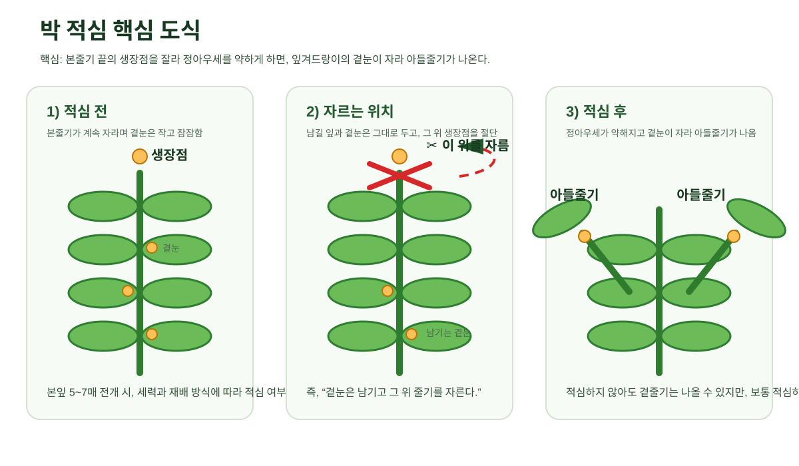
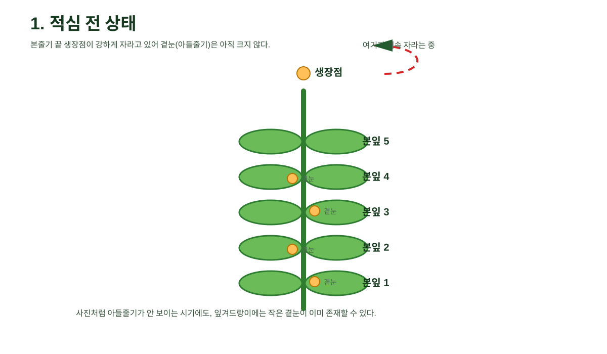
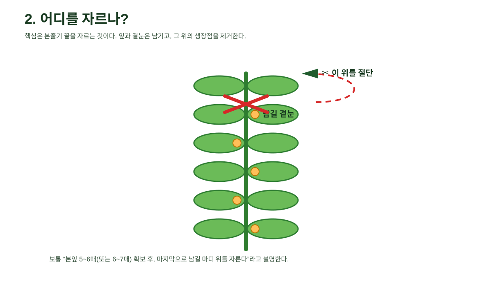
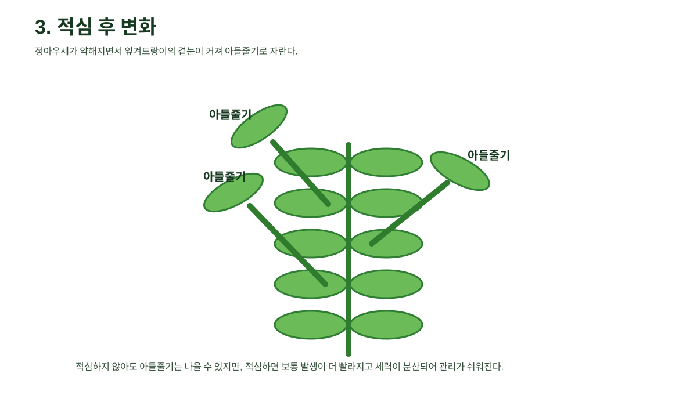

# 박 적심 도식화 정리

> 핵심 주제: **어디를 자르는지**, **자른 뒤 무엇이 달라지는지**

## 한눈에 보는 핵심 도식

## 핵심 요약

- **적심은 본줄기 끝의 생장점을 자르는 작업**이다.
- **잎과 곁눈은 남기고**, 그 위의 생장점을 절단한다.
- 적심 후에는 **정아우세가 약해져 곁눈이 자라 아들줄기**가 된다.
- **적심을 안 해도 아들줄기는 나올 수 있지만**, 적심하면 보통 더 빨리·강하게 나온다.

## 1) 적심 전 상태

- 본줄기가 계속 자람
- 잎겨드랑이의 **곁눈은 아직 작고 눈에 잘 안 띌 수 있음**
- 사진상 “아들줄기가 아직 안 보이는 상태”와 연결해서 이해하면 됨

## 2) 절단 위치

### 기억할 문장

**곁눈은 남기고, 그 위 줄기를 자른다.**

- 보통 본잎 5~6매 또는 6~7매 정도에서 적심을 검토
- 마지막으로 남길 마디의 잎과 곁눈은 보존
- 그 위 생장점을 절단

## 3) 적심 후 변화

- 정아우세가 약해짐
- 잎겨드랑이 곁눈이 커짐
- **아들줄기 2~3개 정도를 남겨 키우는 방식**으로 관리하는 경우가 많음

## 원본 사진 참고

사진상으로는 본줄기 위주로 자라고 있고, **뚜렷한 아들줄기가 아직 크게 발달하지 않은 초기 상태**로 볼 수 있다.

## 이 채팅 기준 최종 이해

| 질문 | 정리된 답 |
|---|---|
| 아들줄기가 아직 안 나온 건가? | 겉으로 뚜렷하지 않을 수 있으나, 작은 곁눈은 이미 있을 수 있음 |
| 본줄기를 자르면 아들줄기가 나오나? | 적심 후 곁눈이 더 잘 자라 아들줄기로 발달함 |
| 적심 안 하면 아들줄기가 안 나오나? | 아니며, 늦게라도 나올 수 있음 |
| 수꽃은 제거하나? | 보통 제거하지 않음 |

## 포함 파일

- `README.md`
- `index.html`
- `images/00_적심핵심도식.svg`
- `images/01_적심전.svg`
- `images/02_절단위치.svg`
- `images/03_적심후.svg`
- `images/04_원본사진_박생육.jpg`
- `archive-manifest.json`
- `verification-report.md`
